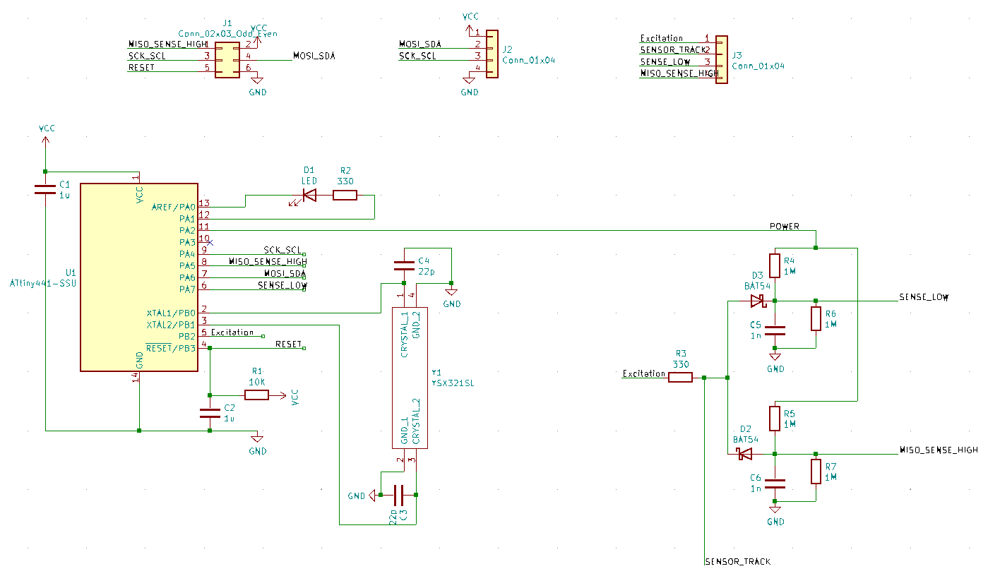
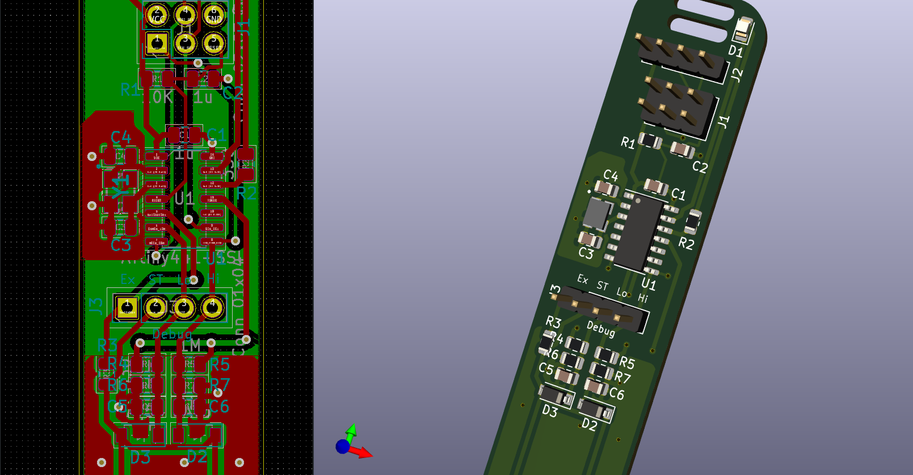

# Routing a custom capacitive "i2c-moisture_sensor"

*This is not a new **design**, but a renewed **layout** of the same thing (**/me** eyeballz **MrFareinheit** & **nohit**)*

## Introduction

### Context

@Miceuz has released a few open source/hardware projects related to sensing moisture level in soil, using capacitive techniques to avoid corrosition.
For instance the [Chirp!](https://github.com/Miceuz/PlantWateringAlarm), that has been heavily cloned...

Personnaly I came across this project "thanks to" AZ Delivery (a german shop on Amazon, I don't recommand them at all), that had a deal for 3rd party testers : 1) buy a thing 2) write a review 3) get a full refund. I'm still waiting for step 3 completion.

Note that the [Chirp!](https://github.com/Miceuz/PlantWateringAlarm) is intented to work as a standalone item : it embeds a battery and a buzzer to autonomously report low watering level of the plant soil. It even measures lighting level using an impressive technique implying applying a reverse voltage on the LED that otherwise is used to indicate the [Chirp!](https://github.com/Miceuz/PlantWateringAlarm)

AZ Delivery claims the item is "delivered with an ebook" (I knew i meant : you'll get an email with the PDF URL... If you're lucky, or you can search by yourself on our website...)

Fake Ad, I found myself actually desperate for any documentation on how to speak to the device, then a found an obscure comment about the [Chirp!](https://github.com/Miceuz/PlantWateringAlarm) that I did not understood at first... The phrasing did made it obvious that "chirp" was designating a project : github repo ! But when it came it was my last clue, I gave it a chance in a SE, and taadaaaa !

Here we we'll more focus on cloning the i²c slave version(sol called "[i2c-moisture-sensor](https://github.com/Miceuz/i2c-moisture-sensor)".

** NB: ** on my work station I had to checkout commit `f0ea6744f6da897fee02f7d46b23bc4d33b74620` (2020/07/22) to get an openable .kicad_pcb file.

Both designs are mainly equivalent, firmwares are also very similar. [1]

### Goals

* Clone this board (it's OSH)
* PCBA print them
* Use them in a cluster of plants

### Motivations

You'll ask me : but why don't you buy a bunch of them to @Miceuz ?

* Because I want a lot of them, given the unit price, better PCBA them

So why re-routing ?

* To learn more of KiCAD
* For the challenge / the pride
* To substitute parts/footprints with cheap "basic parts" from PCBA

And why this document ?

* This is a synthesis of what I learned / understood
* It should allow me to ask for some help/advices
* I may write a blog article out of it afterward

## Work Achieved So Far...

### Schematics

I just copied it, by hand, from the schematics of master/HEAD in [i2c-moisture-sensor](https://github.com/Miceuz/i2c-moisture-sensor)

The core of the circuit is an **AtTiny441**, so I guess most concepts are familiar to readers from #avr(s).

A few notes, though :

* This weird symbol is just a custom crystal, I needed a different pinout,
* 3x2 ISP is for in-lab flashing, nothing will be soldered in-field,
* 4x1 connector is for i²c in-field operation (should be hard-soldered... Let's me think of a few mechanical contrains before [2]).
* LED is for indicating work BUT ALSO for ambient light level measurement !
* Please note that "SENSOR_TRACK" label...

### Understanding operation principle

As I just copied the work, let's link to the [original writing](https://wemakethings.net/2012/09/26/capacitance_measurement/).

As a summary : just send a square wave into a cap formed in part by the soil, and measure its relative variations to get info about the soil moisture.

It seems that it's the operation principle used by the [Chirp!](https://github.com/Miceuz/PlantWateringAlarm) clone I bought. Unsure about the newer one selled by @Miceuz [1].

The schematics above got an upgrade : I can't explain the "why" but it was not enough to measure the high peak of charge to determine the soil capacitance, but you need to offset it at the "low point".

I'm pretty sure (despite [1]) that the **Chirpi!** only uses one line to probe the capacitance...

As a "proof", look at this `get_capacitance()` version :

[Source code on Github](https://github.com/Miceuz/PlantWateringAlarm/blob/master/src/main.c#L147)

It looks "in phase" with the Operation Principle described and linked above.

In regard, in [i2c-moisture-sensor](https://github.com/Miceuz/i2c-moisture-sensor/), this function becomes :
https://github.com/Miceuz/i2c-moisture-sensor/blob/master/src/main.c#L111

Beyond the excitation signal problem (see below), the comparision of codes sounds to explain the hardware variations.

### Routing

Here is the work I did in KiCAD's pcbnew from this schematics.

#### Main circuit

#### Sensor Track

This track is supposed to form a sensible capacitor when burried in soil.

## My Questions

### Schottky diodes

I spent a few time comparing the datasheet of the recommanded diode, with the cheap "basic parts" stock of the PCBA I order from.

To me, the exact rating of the diode here is not really relevant if you think you it as a current rectifier, no matter what is Vdrop : this will/can change the calibration values, but doesn't "hurt" the principle of operation : the 1nF capacitors C5 abd C6 will "display" a given voltage, function of the exponential charge/discharge with time factor is itself function of the soil+sensor capacitice...

Right ??

### Sensor Track 1 My "Design Rules"

I'm not sure how the topology of this traces will influence the capacitance. Once again, my beleif is that it will just inflence calibration factors.

I tried to copy the original PCN design as wel as the schematics, but I just don't speak Maxwelian, eventhough I have some insights...

### Quartz Shielding (?)

What about my crystal routing and sheilding (both under and around ?)

I tried to route any switching signal away from it...

### Excitation Signal Ignition

That is the "best" mystery in the field..
I can cope with my lack of EE skillz but when it comes to software... AVR software futhermore I assume I master it. Not aal bits, but, mostly.

Just like this closed issue mention : "[where is the code ?](https://github.com/Miceuz/i2c-moisture-sensor/issues/29)"

## Conclusion

I'm pretty sure the design I copied is reat, and I hope my layout is coherent. I'm just just freaking out myself how this shit is supposed to operate...

[1] **TODO :** check HEAD/master last version of Chirp!
[2] i²c cable connectors / insertion
[3] Add a DEBUG (analog voltages) pad on the PCB
[4] Lower down that silkscreen line and/or shorten some tracks (sensor included)
